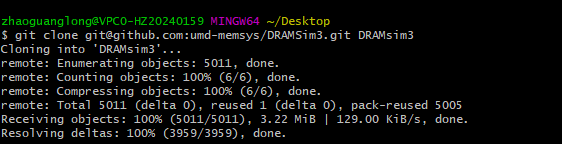

# 与DRAMSim3联合仿真

> 参考：ext/dramsim3/README

用DRAMSim3替代gem5自带的DRAM仿真，因为DRAMSim3的准确性更高。

所有拓展的都在ext目录下

## 准备工作：

* 下载DRAMSim3
* 离线安装cmake3.0+

### 下载DRAMSim3:

~~~bahs
git clone git@github.com:umd-memsys/DRAMSim3.git DRAMsim3
~~~

### 离线安装cmake3.0+

> https://www.cnblogs.com/hichens/p/12859401.html

安装

~~~bash
添加环境变量直接用
~~~

## get DRAMSim3 as part of gem5

1. Download DRAMSim3

   1.1 Go to ext/dramsim3 (this directory)

   1.2 Clone DRAMSim3: git clone git@github.com:umd-memsys/DRAMSim3.git DRAMsim3

   1.3 cd DRAMSim3 && mkdir build

   1.4 cd build

   ~~~bash
   cmake -DCMAKE_CXX_COMPILER=`which g++` -DCMAKE_C_COMPILER=`which gcc` ../
   ~~~

   1.5 cmake ..

   1.6 make

2. Compile gem5

   2.1 cd gem5

   2.2 Business as usual

3. Run gem5 with DRAMsim3

   --mem-type="DRAMsim3"  

需要重新编译gem5

使用时：--mem-type="DRAMsim3"  # 和文件夹同名

~~~bash 
build/ARM/gem5.opt  config/xxx/example.py --mem-type="DRAMsim3"  
~~~

 这样在dramsim3的`results`目录下会出现对应的.vis结果 

支持的DDR在configs目录下面