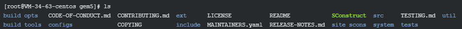

# Gem5

## 1. 简介

[Documentation](https://www.gem5.org/documentation/learning_gem5/introduction/)

GEM5是一款**模块化**的**离散事件驱动**全系统模拟器，它结合了M5(多处理器模拟器)和GEMS（存储层次模拟器）中最优秀的部分，是一款**高度可配置**、**集成多种ISA和多种CPU模型**的**体系结构模拟器**。GEM5已经能够支持多种商用ISA，包括X86、ARM、ALPHA、MIPS、Power、SPARC等，并且能够在X86、ARM、ALPHA上加载LINUX操作系统。是一种名副其实的全系统计算机架构仿真工具。

## 2. gem5功能

1、SE（System-call emulation）和FS（Full System）两种模式的**系统模型**（其中FS模式的系统模型对于典型的交互式应用下系统性能的测试是很有用的）；  

2、从简单到复杂分别是Atomic、Timing、In- order、O3（Out of Order）的四种**CPU模型**；

3、Classic和Ruby两种**存储器模型**。

> GEM5继承了M5和GEMS两种不同的存储器系统。M5的Classic mode存储器是最简单的模型，它提供了简洁快速的可配置性。GEMS的Ruby模型注重于精确度并且支持不同的cache一致性协议。 

## 3. gem5编译过程

（1）下载gem5源文件

（2）配置安装环境

（3）编译gem5

（4）按需配置gem5

（5）仿真测试


### 3.1 文件结构分析

The main source tree includes these subdirectories:
   - build_opts: pre-made default configurations for gem5
   - build_tools: tools used internally by gem5's build process.
   - configs: example simulation configuration scripts
   - ext: less-common external packages needed to build gem5
   - include: include files for use in other programs
   - site_scons: modular components of the build system
   - src: source code of the gem5 simulator
   - system: source for some optional system software for simulated systems
   - tests: regression tests
   - util: useful utility programs and files


所有gem5的配置文件能够被发现在 `configs/.`

`（1）`boot/：

这些是在 `full-system` 模式下使用的rcS文件。 这些文件在Linux启动后由模拟器加载，并由Shell执行。 在全系统模式下运行时，其中大多数用于控制基准。 其中一些是实用程序功能，例如hack_back_ckpt.rcS。 这些文件将在 `full-system simulation` .一章中更深入地介绍。

`（2）`common/：

该目录包含许多用于创建模拟系统的帮助程序脚本和函数。例如，`Caches.py`与前面各章中创建的caches.py和caches_opts.py文件相似。
`Options.py`包含可以在命令行上设置的各种选项。像CPU的数量，系统时钟等等。这是查看是否要更改的选项是否已经包含命令行参数的好地方。
`CacheConfig.py`包含用于设置经典内存系统的缓存参数的选项和功能。
`MemConfig.py`提供了一些用于设置内存系统的帮助程序功能。
FSConfig.py包含必要的功能，可以为许多不同种类的系统设置全系统仿真。全系统仿真将在本章中进一步讨论。
`Simulation.py`包含许多帮助程序功能，用于设置和运行gem5。该文件中包含的许多代码都用于管理保存和还原检查点。下面的examples /中的示例配置文件使用该文件中的功能来执行gem5仿真。该文件非常复杂，但是在模拟的运行方式上也具有很大的灵活性。

`（3）`dram/： 包含用于测试DRAM的脚本。

`（4）`example/：

该目录包含一些示例gem5配置脚本，可以直接使用它们来运行gem5。 具体来说，`se.py`和`fs.py`非常有用。 有关这些文件的更多信息，请参见下一部分。 此目录中还有一些其他实用程序配置脚本。

`（5）`ruby/：此目录包含Ruby及其随附的缓存一致性协议的配置脚本。 更多细节可以在Ruby一章中找到。

`（6）`splash2/：目录包含用于运行splash2基准套件的脚本，其中包含一些用于配置模拟系统的选项。

`（7）`topologies/：该目录包含创建Ruby缓存层次结构时可以使用的拓扑的实现。 更多细节可以在Ruby一章中找到。

### 3.2 编译详细过程

#### 编译指令：

~~~bash
scons <build dir>/<configuration>/<target>
# e.g. scons build/X86/gem5.opt
~~~

* \<build dir> ：通常是主目录下的build文件夹

* \<configuration>：设置的编译选项，可选ISA类型、CPU模型、Ruby一致性协议等。

* \<target>：指定生成的gem5的类型，如下：

* -j4：计算机可用核心数为4

  | Index | Target name | Express                                                      |
  | ----- | ----------- | ------------------------------------------------------------ |
  | 1     | gem5.debug  | 关闭了优化。保证变量不会被优化掉，功能不会被意料外的内联（inlined），以及控制流行为正常。该版本与gdb类的工具合作良好，然而关闭优化会造成该版本明显慢于其它版本。当使用gdb或valgrind等工具并且不希望任何细节被模糊掉时应该选择该版本，否则建议选择其它版本。 |
  | 2     | gem5.opt    | 打开优化的同时保留了部分调试功能。该版本良好地平衡了模拟速度与调试观察，是所有环境中最优的版本。 |
  | 3     | gem5.fast   | 打开优化并关闭调试部分。最优的速度，代价是不能进行运行时错误检查与调试输出。如果确信所有功能可以正确运行并想要获得峰值性能，建议使用该版本。 |
  | 4     | gem5.prof   | 类似于gem5.fast，但仍然保留了一些功能可以用于gprof分析工具。该版本不常用，但可以用于找出gem5中应当被注意的部分以提升性能。 |
  | 5     | gem5.perf   | 同gem5.prof，但是instrumentation使用google perftools，允许被google-pprof分析。该分析版本是gem5.prof的补充，可能可以在所有基于Linux的系统中替换gem5.prof。 |

   日常使用建议用.opt格式，用于分析建议使用prof或者perf 

#### Dependencies：

> （how to get those？download files and upload to 74 server.）
>
> [dependences](https://www.gem5.org/documentation/general_docs/building#dependencies)

- **gcc**: gcc is used to compiled gem5. **Version >=7 must be used**. We support up to gcc Version 11.
- ~~**Clang**: Clang can also be used. At present, we support Clang 6 to Clang 11 (inclusive).~~
- **SCons** : gem5 uses SCons as its build environment. SCons 3.0 or greater must be used.
- **Python 3.6+** : gem5 relies on Python development libraries. gem5 can be compiled and run in environments using Python 3.6+.
- **protobuf 2.1+** (Optional): The protobuf library is used for trace generation and playback.
- **Boost** (Optional): The Boost library is a set of general purpose C++ libraries. It is a necessary dependency if you wish to use the SystemC implementation.
- 可能还需要：swig、zlib、m4

#### 安装依赖参考：

ubuntu18.04 参考命令：

~~~bash
sudo apt install build-essential git m4 scons zlib1g zlib1g-dev \
    libprotobuf-dev protobuf-compiler libprotoc-dev libgoogle-perftools-dev \
    python3-dev python3-six python libboost-all-dev pkg-config
~~~


ubuntu20.04 参考命令：

~~~bash
sudo apt install build-essential git m4 scons zlib1g zlib1g-dev \
    libprotobuf-dev protobuf-compiler libprotoc-dev libgoogle-perftools-dev \
    python3-dev python3-six python-is-python3 libboost-all-dev pkg-config
~~~

#### 下载代码：

~~~bash
git clone https://github.com/gem5/gem5.git
# git clone https://gem5.googlesource.com/public/gem5
~~~

#### 使用SCons编译：

~~~bash
scons build/{ISA}/gem5.{variant} -j {cpus}
~~~

where `{ISA}` is the target (guest) Instruction Set Architecture, and `{variant}` specifies the compilation settings. For most intents and purposes `opt` is a good target for compilation. The `-j` flag is optional and allows for parallelization of compilation with `{cpus}` specifying the number of threads. A single-threaded compilation from scratch can take up to 2 hours on some systems. We therefore strongly advise allocating more threads if possible.

The valid ISAs are:

- ARCH
- ARM
- NULL
- MIPS
- POWER
- RISCV
- SPARC
- X86

#### 测试：

~~~bash
./build/{ISA}/gem5.{variant} [gem5 options] {simulation script} [script options]
~~~


## 4. 离线环境配置

>  参考：
>
> * [Getting Started with gem5](https://www.gem5.org/getting_started/)
>
> * :star:[Documentation](https://www.gem5.org/documentation/learning_gem5/introduction/)
>
> * [Doc](https://www.gem5.org/documentation/)

### 4.1 下载gem5

使用git（google, **不可用**）

~~~bash
git clone https://gem5.googlesource.com/public/gem5
~~~

or use github，下载完成后上传至74服务器

~~~bash
git clone <-b xxx> https://github.com/gem5/gem5.git
~~~



### 4.2 安装必要环境

[环境需求](https://www.gem5.org/documentation/general_docs/building#dependencies):dizzy_face:

| Index | Needed：required                                             | Installed(74)                    |
| ----- | ------------------------------------------------------------ | -------------------------------- |
| 1     | gcc：Version>=7                                              | 4.4.7:point_right:10.3.0         |
| 2     | [SCons](https://www.scons.org/): Version>=3.0                | None:point_right:4.3.0           |
| 3     | Python 3.6+                                                  | Python3.7                        |
| 4     | [protobuf](https://github.com/protocolbuffers/protobuf) 2.1+(Optional) | None:point_right:3.19.x          |
| 5     | Boost(Optional)                                              | None:point_right:1.78            |
| 6     | [swig](http://www.swig.org/)                                 | None:point_right:4.0.2           |
| 7     | [zlib](http://www.zlib.net/)                                 | zlib 1.2.3:point_right:1.2.11    |
| 8     | [m4](http://www.gnu.org/software/m4/)                        | m4 1.4.13:point_right:~~1.4.19~~ |
| 9     | -                                                            | -                                |

#### 离线安装gcc

gcc必须手动升级，自动升级版本不够，[下载](http://mirrors.nju.edu.cn/gnu/gcc/gcc-10.1.0/gcc-10.1.0.tar.gz)，[安装](https://blog.csdn.net/hificamera/article/details/109161564)，时间挺长[的](https://blog.csdn.net/weixin_42097690/article/details/106220752)（配置语言把go去掉）。

| index | Needed                |
| ----- | --------------------- |
| 1     | gmp 4.2+              |
| 2     | mpfr 3.1.0+           |
| 3     | mpc 0.8.0+ （libmpc） |

本地离线安装步骤：

Step1：下载文件

~~~bash
# 下载gcc源文件
rsync rsync://mirrors.tuna.tsinghua.edu.cn/gnu/gcc/gcc-10.3.0/gcc-10.3.0.tar.gz ./  # 下载gcc10源码包
tar xvf gcc-10.3.0.tar.gz   
cd gcc-10.3.0

# 在线情况查看所需包（然后下载这些包）
./contrib/download_prerequisites

# 下载gcc依赖包（上一步查到的）到目录里
wget xxx.tar.gz
wget xxx.tar.gz
wget xxx.tar.gz
wget xxx.tar.gz
~~~

Step2：配置安装选项

~~~bash
# 复制依赖包到gcc10.3.0目录
# cp xx.tar gcc10.3.0

# 进入新目录去编译
mkdir buid
cd build

# 指定gcc10安装地址，指定所需安装语言，不支持32位
../gcc-10.3.0/configure --prefix=<install dir> --enable-languages=c,c++ --disable-multilib 
~~~

Step3：编译安装（3-4h）

~~~bash
make -j32   # 加了job超级快
make install   
~~~

Step4：指向gcc10

~~~bash
setevn PATH "/share/users/zhaoguanglong/tool/gcc10/bin:"$PATH
setevn LD_LIBRARY_PATH "/share/users/zhaoguanglong/tool/gcc10/lib64:"$LD_LIBRARY_PATH
setevn MAINPATH "/share/users/zhaoguanglong/tool/gcc10/main:"$MAINPATH
# 测试
gcc -v
~~~

Step5：升级安装binutils（原始版本低会出错）

~~~bash
# 安装方法： https://blog.csdn.net/qq_20821119/article/details/119189401
~~~

#### zlib安装：readme

~~~bash
https://github.com/madler/zlib
~~~


#### [boost](https://boostorg.jfrog.io/artifactory/main/release/1.78.0/source/)安装：

~~~ bash 
https://www.bianchengquan.com/article/434903.html
~~~


#### scons 4.3.0安装

[readme](https://github.com/SCons/scons/tree/rel_4.3.0)，也可以不安装使用，直接用或者**环境变量**形式:happy:

~~~ bash 
https://github.com/SCons/scons.git
~~~


#### protobuf 3.19x安装

中途需要离线安装依赖库，74服务器本来就有这些依赖库，但是不可用。

~~~ bash 
https://github.com/protocolbuffers/protobuf.git
~~~

Step1：[安装依赖](https://blog.csdn.net/qq_40442753/article/details/110437580)autoconf、automake、libtool，**要安装在同一目录下**

Step2：设置依赖环境变量

Step3：安装protobuf，[readme](https://zhuanlan.zhihu.com/p/266787579)

Step4：设置环境变量，测试

~~~ bash 
protoc -h
~~~


#### swig安装：[readme](https://blog.csdn.net/weixin_42028608/article/details/106458218)

#### python389安装

加上两个选项 **--enable-optimizations --enable-shared** 

Tip：这是启用动态库版本。如果要编译一个库的源代码，可以把它编译成静态库，也可以把它编译成动态库。如果想编译成静态库，就用 --enable-shared参数；如果想编译成静态库，就用--enable-static参数。  


最终的环境变量：

* gcc10.3.0（PATH，MANPATH，LD_LIBRARY_PATH）

* scons（PATH）
* binutils（PATH）
* protobuf & protobuf_tool（PATH）
* zlib（MANPATH，LD_LIBRARY_PATH）
* boost（PATH）
* python389（PATH，LD_LIBRARY_PATH）

### 4.3 编译gem5

参考：[Build gem5](https://www.gem5.org/documentation/learning_gem5/part1/building/)

编译gem5，参数参考上一节在线方法

~~~bash
cd gem5
# rm -rf build/
# python3  <which scons.py> build/X86/gem5.opt -j <NUMBER OF CPUs ON YOUR PLATFORM>
pyrhon3 /path/scons.py build/X86/gem5.opt -j32
~~~

### 4.4 run simlulation

编译完成得到gem5的二进制文件，可以用来运行仿真。接口是**python脚本**，gem5二进制文件读取并执行python脚本，用来创建系统和执行仿真(about 45min with j4)

```bash
build/X86/gem5.opt configs/learning_gem5/part1/simple.py
```


 