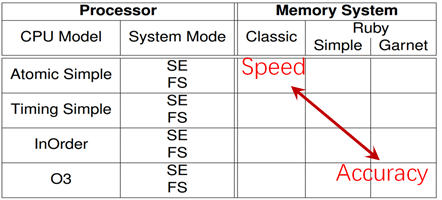

# Gem5 Introduction

Gem5是一款模块化的离散事件驱动全系统模拟器，它结合了M5和GEMS中最优秀的部分，M5提供了高度可配置的模拟框架，支持多种ISAs和CPU模型；GEMS补充了M5的特性，提供了详细而灵活的内存系统，包括多种cache 一致性协议和互连模型，是一款高度可配置、集成多种ISA，多种CPU模型的体系结构模拟器。

gem5模拟器目前支持多种ISAs，包括Alpha、ARM、MIPS、Power、SPARC和x86。模拟器的模块性允许这些不同的ISAs插入到通用CPU模型和内存系统中，而不需要为每一种ISAs设置一种专用的CPU模型和存储模型，这使得模拟器模块化程度较高且易于在不同CPU之间切换。

M5是由Michigan大学开发的一款开源的多处理机模拟器，受到了业内的广泛关注，很多高水平论文都采用M5作为研究工具。另一方面，Wisconsin推出的GEMS能够对储存层次进行详细而灵活的模拟，包括对多种不同的cache一致性协议和互联模型的支持。目前的GEM5是M5和GEMS的一个紧耦合版本。

## 1.总体目标

gem5模拟器的目标是成为一个用于体系结构建模的优秀工具。这一目标的三个关键方面是灵活性，可用性，高度可协作性。

图一 Speed vs. Accuracy

### 1.1 灵活性

灵活性是一个好的模拟器的基础。当一个想法从概念落地到一个特定的设计时，程序员需要一个工具来评估系统，平衡仿真速度和准确性。不同类型的实验可能有不同的模拟要求。例如，某些实验可能需要一个精细的CPU模型，但是没有必要进行多核建模。而某些实验可能需要多个CPU，但是这些CPU不需要太多的细节。所以模拟器的灵活性必不可少，使得程序员能够以更少的开销更快地完成更多的工作。

gem5模拟器就是这样一个工具，提供了各种各样的功能和组件，涵盖了仿真速度和精度之间的权衡。 如图1所示。 

#### CPU模型

gem5模拟器目前提供了四种不同的CPU模型：AtomicSimple、TimingSimple、InOrder和O3。AtomicSimple和TimingSimple是非流水线CPU模型，AtomicSimple是一种最小的单IPC CPU模型，适用于快速功能模拟；TimingSimple与之类似，但是使用了存储器访问时序模型，用以统计存储器访问延迟；InOrder是一个按序流水线CPU模型，该模式下，可以配置硬件支持的线程数量；O3是一个乱序流水线CPU模型，可以支持超标量结构和SMT。InOrder与O3都是execute-in-execute（指令的执行只在执行阶段）的设计。

#### 系统模式

gem5支持两种执行模式：System-call Emulation（SE）和Full-System（FS）。即系统调用模式和全系统模式。

* SE模式中，并不仿真系统中的所有设备，不需要实例化真实系统中所需的所有硬件设备。而是`专注于仿真 CPU 和内存系统`。当程序执行系统调用时，gem5会捕捉到，同时模拟调用，通常是传递给主机操作系统。通过模拟大部分的系统调用，`避免了对外设和OS进行建模的需要`。SE模式下，没有线程调度器，线程必须静态的映射到cores，因此会限制多线程应用。SPEC CPU基准测试通常在SE模式下运行。

* FS（全系统）模式对一个完整系统，包括OS和外设进行了建模，运行未经修改的内核，类似于运行虚拟机。支持执行用户和内核指令。FS模式中，gem5提供了一个适合运行操作系统的裸机环境，包括中断，异常等，并不是所有ISAs都支持此模式。

FS相对于SE，精度更高，可以执行更多类型的负载。虽然SPEC CPU基准测试通常在SE模式下运行，但是在FS模式下运行它们将提供与OS更实际的交互。因此需要许多OS服务或I/O设备的工作负载可能只在FS模式下运行。

如果不需要对操作系统进行建模，并且需要额外的性能，则应该使用 SE 模式。但是，如果需要对系统进行高保真建模，或者像页表遍历这样的 OS 交互很重要，那么应该使用 FS 模式。

#### fs模式优点

1. `More realistic`
2. Runs unmodified OS binaries
3. Less magic than syscall emulation mode
4. OS investigations
5. Devices are simulated

#### 存储系统

支持两种存储系统模型：Classic和Ruby。Classic模型（来自M5）提供了一个快速且易于配置的内存系统；Ruby模型（来自GEMS）提供了一种灵活且能够精确模拟的内存系统，支持cache一致性。Ruby内存模型支持大量的互连拓扑结构，同时包括两种不同的网络模型。组件之间的链接使用一个简单的python文件声明，然后通过最短路径分析创建路由表。在确定链接和路由表后，根据不同的网络模型进行实现。两种网络模型为：

1、Simple网络模型：只对链接，路由延迟和链路带宽，并没有对路由器资源争用和流量控制建模。

2、Garnet网络模型：对路由建立了详细的模型，包括相关的资源竞争和流量控制。

### 1.2 可用性

gem5用户有几种类型，每个人都有不同的目标和需求。这些人包括学术和企业研究人员、工业工程师、本科生和研究生。Gem5的开发者们希望gem5模拟器能够广泛地提供给所有这些类型的用户。gem5许可证(基于BSD)对企业用户和学术界都很友好。gem5社区非常活跃，有很多协作技术可以促进gem5的使用和开发。

## 2.设计特点

本节重点介绍gem5实现的几个关键方面：面向对象的设计、Python集成、特定领域的语言和标准化接口的使用。

### 2.1 面向对象

灵活性是gem5模拟器的一个重要目标，也是其成功的关键方面。灵活性主要是通过面向对象的设计来实现的。gem5模拟器中的`每个主要仿真组件都是SimObjects`，它们共享配置、初始化、统计和序列化(检查点)的公共行为。SimObjects包括了具体的硬件组件(如处理器内核、缓存、互连元素和外设)以及更抽象的实体(如用于系统调用仿真的工作负载及其关联的流程上下文)。这里的外设包括简单的定时器到复杂的网络接口控制器，通过使用基类来封装公共设备接口，以避免代码重复，简化实现。所有的SimObject对象都由两种类表示，python类和c++类。Python类的定义指定了SimObject的参数，并且可以在配置脚本文件中使用。公共Python基类为实例化、命名和设置参数值提供了统一的机制。C++类包含了SimObject的状态和其它行为，同时包括了关键性能的仿真模型。

### 2.2 Python集成

gem5中的代码85%是用C++写成的，15%的Python代码主要负责SimObject的初始化、配置和模拟控制。模拟器在启动时立即开始执行Python代码，标准的main函数使用python编写，所有的命令行处理和启动代码都是python代码。

### 2.3 领域特定语言

gem5提供了两种特定领域的语言，一种用于描述ISA（继承自M5），另一种用于描述cache的一致性协议（继承自GEMS）。

#### ISA DSL

用于统一二进制指令的解码和它们的语义规范。gem5通过使用一个通用的C++基类来描述指令，从而实现了ISA的独立。每种ISA会重新基类中继承的方法，例如execute()。ISA描述语言允许用户简洁地指定所需的c++代码。

#### Cache Coherence DSL

SLICC是一种DSL，用于灵活的实现cache一致性协议。SLICC目前支持AMD Opteron的基于广播的一致性协议和CMP的目录协议。SLICC将cache，mem，DMA控制器定义为单独的per-memory-block的状态机，这些状态机组合称为整个的协议。gem5中的SLICC将协议定义为一组状态、事件、转换和操作，同时将状态机特定的逻辑和协议无关的组件（例如cache）绑定在一起。gem5的SLICC会自动生成python和c++文件，同时也支持局部变量，以简化编程提高性能

### 2.4 标准化接口

标准化接口是面向对象的基础。有两个核心的接口，端口（port）接口和消息缓冲（message buffer）接口。

1、端口接口：连接内存对象，包括cpu和caches，caches到总线，总线到外设和内存。该接口支持三种机制来访问数据，1) timing模式，用来建模带有详细时序的内存访问，会有request和response的消息机制；2) atomic模式，用来获取时序信息，但是没有消息机制，状态会直接发生变化；3) 功能模式，存储操作不会改变时序信息。

2、消息缓冲接口：Ruby使用端口接口来连接cpu和外设，同时使用消息缓冲接口连接Ruby内部对象。两个接口非常类似。

## 3.用户资源

所有gem5模拟器的文档和信息都可以在网站[http://www.gem5.org](http://www.gem5.org/)上找到。该网站包括如何检查、构建和运行gem5模拟器的说明，以及如何下载OS二进制文件和磁盘映像等补充支持文件