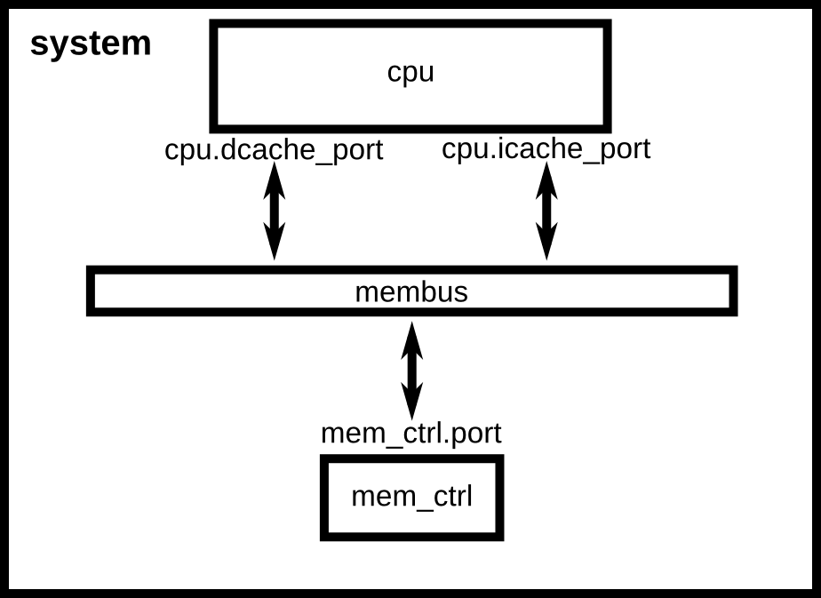
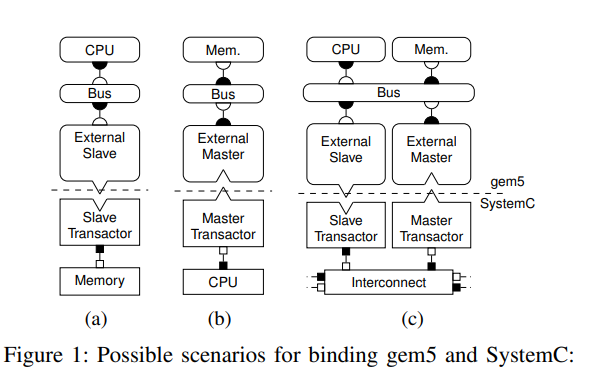

api:

http://doxygen.gem5.org/release/current/index.html


# Gem5 简介

此部分见另一个markdown文档，[gem5 introduction.md](./gem5 introduction.md)


# 编译Gem5

此部分见另一个markdown文档，[Gem5.md](./Gem5.md)


# 构造配置脚本

> 参考：（[1]相对老旧，不过内容比较系统完整，新的可以看官网[2]）
>
> [1] http://learning.gem5.org/book/index.html
>
> [2] https://www.gem5.org/documentation/learning_gem5/introduction/
>
> 官方提供的例子在`configs/examples`下

## 创建配置文件

创建配置文件，配置文件是一个python脚本，内容完全由用户构建。

~~~sh
mkdir configs/
touch configs/tutorial/simple.py
~~~

创建了一个python脚本，该脚本会被gem5所嵌入的python所执行，因此完全等同于普通python脚本，可以使用所有的库和python特征。


第一件事是引用我们编译出来的m5库和所有的SimObjects，所以使用时就把gem5完全看作一个python的库。

~~~python
import m5
from m5.objects import *
~~~


接下来创建仿真对象（我们要去仿真的系统）。System是仿真系统中其他对象的父类，包含许多功能信息。可以简单理解为一个python类。

~~~python
system = System()
~~~


设置系统时钟：先创建时钟域，再设置该时钟域的时钟频率。最后设置该时钟域的电压，暂时使用默认配置，无需考虑电压。

~~~python
system.clk_domain = SrcClockDomain()
system.clk_domain.clock = '1GHz'
system.clk_domain.voltage_domain = VoltageDomain()
~~~


有了系统之后设置内存，使用`timing` model进行内存仿真。

~~~python
system.mem_mode = 'timing'
system.mem_ranges = [AddrRange('512MB')]
~~~


创建CPU，基于时序的CPU：TimingSimpleCPU。此 CPU 模型在单个时钟周期内执行每条指令以执行，但内存请求除外，这些指令流经内存系统。

~~~
system.cpu = TimingSimpleCPU()
~~~


创建系统范围的内存总线。

~~~python
system.membus = SystemXBar()
~~~


将CPU上的cache端口连接到membus上，左侧是请求端口，右侧是响应端口。

~~~python
system.cpu.icache_port = system.membus.cpu_side_ports
system.cpu.dcache_port = system.membus.cpu_side_ports
~~~

 

依靠以上描述就构造了一个简单系统，下面对该系统进行仿真设置。 


完成系统后还需要给CPU加一些进程测试一下。我们准备使用SE Mode，这个模式下将CPU指向编译的可执行文件，这里以Hello World为例：创建一个process，设置相关的命令和参数，让CPU用这个process作为它的负载（workload），最后在CPU上创建一个功能执行的环境（ functional execution contexts）

~~~python
binary = 'tests/test-progs/hello/bin/x86/linux/hello'

# for gem5 V21 and beyond
system.workload = SEWorkload.init_compatible(binary)

process = Process()
process.cmd = [binary]
system.cpu.workload = process
system.cpu.createThreads()
~~~


最后一步就是实例化对象，创建root类，实例化每个SimObject，这个过程将创建对应的C++程序。 

~~~python
root = Root(full_system = False, system = system)
m5.instantiate()
~~~


 启动这个实例并且在完成后检查系统状态 

~~~python
print ('Beginning simulation!')
exit_event = m5.simulate()

print ('Exiting @ tick %i because %s' % (m5.curTick(), exit_event.getCause()))
~~~


运行gem5

~~~sh
build/X86/gem5.opt configs/tutorial/simple.py
~~~


创建脚本的整体步骤如下：

~~~flow
st=>start: 开始
op1=>operation: 构造模拟系统
op2=>operation: 设置仿真
op3=>operation: 运行gem5
e=>end: 结束

st->op1->op2->op3->e
~~~

完整代码：

~~~python

import m5
from m5.objects import *

# 创建仿真对象
system = System()

# 设置时钟电压
system.clk_domain = SrcClockDomain()
system.clk_domain.clock = '1GHz'
system.clk_domain.voltage_domain = VoltageDomain()

# 哦欸之内存模型
system.mem_mode = 'timing'
system.mem_ranges = [AddrRange('512MB')]

# 创建CPU对象
system.cpu = TimingSimpleCPU()

# 创建内存总线
system.membus = SystemXBar()

# 连接CPU和内存对象
# 请求端口 = 响应端口
system.cpu.icache_port = system.membus.cpu_side_ports
system.cpu.dcache_port = system.membus.cpu_side_ports

# 中断
system.cpu.createInterruptController()
# system.cpu.interrupts[0].pio = system.membus.mem_side_ports
# system.cpu.interrupts[0].int_requestor = system.membus.cpu_side_ports
# system.cpu.interrupts[0].int_responder = system.membus.mem_side_ports

system.system_port = system.membus.cpu_side_ports

# MEM CTRL
system.mem_ctrl = MemCtrl()
system.mem_ctrl.dram = DDR3_1600_8x8()
system.mem_ctrl.dram.range = system.mem_ranges[0]
system.mem_ctrl.port = system.membus.mem_side_ports

## 以上完成仿真系统的实例化

## 以下设置仿真进程
# process
binary = 'tests/test-progs/hello/bin/x86/linux/hello'

# for gem5 V21 and beyond
system.workload = SEWorkload.init_compatible(binary)

process = Process()
process.cmd = [binary]
system.cpu.workload = process
system.cpu.createThreads()

# root
root = Root(full_system = False, system = system)
m5.instantiate()


print("Beginning simulation!")
exit_event = m5.simulate()

# 仿真结束检查系统状态
print('Exiting @ tick {} because {}'
      .format(m5.curTick(), exit_event.getCause()))
~~~


## 增加cache

> [add cache](https://www.gem5.org/documentation/learning_gem5/part1/cache_config/)

### 经典缓存和 Ruby

gem5 目前有两个完全不同的子系统来模拟系统中的片上缓存，“经典缓存”和“Ruby”。这两种模型之间的区别在于 Ruby 旨在详细建模缓存一致性。Ruby 的一部分是 SLICC，一种用于定义缓存一致性协议的语言。另一方面，经典缓存实现了简化且不灵活的 MOESI 一致性协议。

如果正在对缓存一致性协议的更改进行建模，或者一致性协议可能会对结果产生一阶影响，则使用 Ruby。否则，如果一致性协议不重要，则使用经典缓存。

 完整代码：

~~~python
from m5.objects import Cache


class L1Cache(Cache):
    assoc = 2
    tag_latency = 2
    data_latency = 2
    response_latency = 2
    mshrs = 4
    tgts_per_mshr = 20
    
    def __init__(self, options=None):
        super(L1Cache, self).__init__()
        pass

    def connectCPU(self, cpu):
    	# need to define this in a base class!
    	raise NotImplementedError

    def connectBus(self, bus):
        self.mem_side = bus.cpu_side_ports
    
    
class L1ICache(L1Cache):
    size = '16kB'

    def __init__(self, options=None):
        super(L1ICache, self).__init__(options)
        if not options or not options.l1i_size:
            return
        self.size = options.l1i_size
    
    def connectCPU(self, cpu):
        self.cpu_side = cpu.icache_port

class L1DCache(L1Cache):
    size = '64kB'
    
    def __init__(self, options=None):
        super(L1DCache, self).__init__(options)
        if not options or not options.l1d_size:
            return
        self.size = options.l1d_size

    def connectCPU(self, cpu):
        self.cpu_side = cpu.dcache_port
    
   
class L2Cache(Cache):
    size = '256kB'
    assoc = 8
    tag_latency = 20
    data_latency = 20
    response_latency = 20
    mshrs = 20
    tgts_per_mshr = 12
    
    def __init__(self, options=None):
        super(L2Cache, self).__init__()
        if not options or not options.l2_size:
            return
        self.size = options.l2_size
    
    def connectCPUSideBus(self, bus):
    self.cpu_side = bus.mem_side_ports

    def connectMemSideBus(self, bus):
        self.mem_side = bus.cpu_side_ports
~~~


~~~python

import m5
from m5.objects import *

from caches import *
import argparse

parser = argparse.ArgumentParser(description='A simple system with 2-level cache.')
parser.add_argument("binary", default="", nargs="?", type=str,
                    help="Path to the binary to execute.")
parser.add_argument("--l1i_size",
                    help=f"L1 instruction cache size. Default: 16kB.")
parser.add_argument("--l1d_size",
                    help="L1 data cache size. Default: Default: 64kB.")
parser.add_argument("--l2_size",
                    help="L2 cache size. Default: 256kB.")

options = parser.parse_args()


# 创建仿真对象
system = System()

# 设置时钟电压
system.clk_domain = SrcClockDomain()
system.clk_domain.clock = '1GHz'
system.clk_domain.voltage_domain = VoltageDomain()

# 创建内存模型
system.mem_mode = 'timing'
system.mem_ranges = [AddrRange('512MB')]

# 创建CPU对象
system.cpu = TimingSimpleCPU()
# 创建L1缓存
system.cpu.icache = L1ICache()
system.cpu.dcache = L1DCache()
# 连接缓存
system.cpu.icache.connectCPU(system.cpu)
system.cpu.dcache.connectCPU(system.cpu)
# 创建L2总线
system.l2bus = L2XBar()
# 连接l1cache和l2bus
system.cpu.icache.connectBus(system.l2bus)
system.cpu.dcache.connectBus(system.l2bus)
# 创建L2cache
system.l2cache = L2Cache()
system.l2cache.connectCPUSideBus(system.l2bus)
system.membus = SystemXBar()
system.l2cache.connectMemSideBus(system.membus)

# 连接CPU和内存对象
# 请求端口 = 响应端口
# system.cpu.icache_port = system.membus.cpu_side_ports
# system.cpu.dcache_port = system.membus.cpu_side_ports

# 中断
system.cpu.createInterruptController()
# system.cpu.interrupts[0].pio = system.membus.mem_side_ports
# system.cpu.interrupts[0].int_requestor = system.membus.cpu_side_ports
# system.cpu.interrupts[0].int_responder = system.membus.mem_side_ports

system.system_port = system.membus.cpu_side_ports

# MEM CTRL
system.mem_ctrl = MemCtrl()
system.mem_ctrl.dram = DDR3_1600_8x8()
system.mem_ctrl.dram.range = system.mem_ranges[0]
system.mem_ctrl.port = system.membus.mem_side_ports

## 以上完成仿真系统的实例化

## 以下设置仿真进程
# process
binary = 'tests/test-progs/hello/bin/x86/linux/hello'

# for gem5 V21 and beyond
system.workload = SEWorkload.init_compatible(option.binary)

process = Process()
process.cmd = [option.binary]
system.cpu.workload = process
system.cpu.createThreads()

# root
root = Root(full_system = False, system = system)
m5.instantiate()


print("Beginning simulation!")
exit_event = m5.simulate()

# 仿真结束检查系统状态
print('Exiting @ tick {} because {}'
      .format(m5.curTick(), exit_event.getCause()))
~~~


 

## se和fs系统模式

gem5 可以在两种不同的模式下运行，称为“`系统调用仿真`”(syscall emulation)和“`全系统`”(full system)或 SE 和 FS 模式。

在全系统模式下，gem5 模拟整个硬件系统并运行未修改的内核，全系统模式类似于运行虚拟机。

另一方面，Syscall 仿真模式并不仿真系统中的所有设备，而是`专注于仿真 CPU 和内存系统`。系统调用仿真更容易配置，因为您不需要实例化真实系统中所需的所有硬件设备。但是，系统调用仿真仅仿真 Linux 系统调用，因此仅对`用户模式代码`进行建模。

如果不需要对操作系统进行建模，并且需要额外的性能，则应该使用 SE 模式。但是，如果需要对系统进行高保真建模，或者像页表遍历这样的 OS 交互很重要，那么应该使用 FS 模式。


### fs模式优点

1. More realistic
2. Runs unmodified OS binaries
3. Less magic than syscall emulation mode
4. OS investigations
5. Devices are simulated

### 主要不同

FS模式和SE模式之间有许多不同之处。最重要的是，在全系统模式下，很难伪造东西。例如，在FS模式下，作为用户，必须提供一个已编译的Linux内核和一个磁盘映像。然后，要在gem5中运行应用程序，必须启动操作系统，然后才能像运行计算机一样进行交互。


# ARM 全系统仿真

## 

>参考：https://www.gem5.org/documentation/learning_gem5/part1/extending_configs

编译终端，编译出m5term用来作为全系统仿真的终端（可以用telnet，74没有）

~~~bash
$ cd util/term/
$ make
~~~

下载fs的[系统镜像](https://www.gem5.org/documentation/general_docs/fullsystem/guest_binaries)，并保存再gem5根目录下，如`gem5/fs_images`

下载是以下三个文件：第一个文件使用其uboot和内核文件，后面两个文件是disk文件。


下载图像后，将fs_images目录添加到环境变量，方便执行指令：

```bash
$ setenv IMG_ROOT "/absolute/path/to/fs_images/<image-directory-name>
```


准备运行 FS ARM 模拟。从 gem5 存储库的根目录运行：

```bash
$ ./build/ARM/gem5.opt configs/example/arm/fs_bigLITTLE.py \
    --caches \
    --bootloader="$IMG_ROOT/binaries/<bootloader-name>" \
    --kernel="$IMG_ROOT/binaries/<kernel-name>" \
    --disk="$IMG_ROOT/disks/<disk-image-name>" \
    --bootscript=path/to/bootscript.rcS
# 示例：(注意rcS,S是大写)
$ ./build/ARM/gem5.opt configs/example/arm/fs_bigLITTLE.py \
    --caches \
    --bootloader="$IMG_ROOT/binaries/boot.arm64" \
    --kernel="$IMG_ROOT/binaries/vmlinux.arm64" \
    --disk="$IMG_ROOT/disks/aarch32-ubuntu-natty-headless.img" \
    --bootscript=configs/boot/bbench-gb.rcS \
    --root=/dev/vda1
```

通过终端查看全系统仿真运行的细节，以及系统启动后的交互

```bash
$ ./util/term/m5term 3456
```

仿真时间长（3-5h），在m5term能看到仿真运行细节信息，系统启动后在m5term里登录运行，也比较卡。


# 混合仿真

## gem5+Nvmain

https://github.com/cyjseagull/gem5-nvmain-hybrid-simulator

https://github.com/SEAL-UCSB/NVmain

https://blog.csdn.net/tristan_tian/article/details/79435112?spm=1001.2101.3001.6650.7&utm_medium=distribute.pc_relevant.none-task-blog-2%7Edefault%7EBlogCommendFromBaidu%7EHighlightScore-7.queryctrv2&depth_1-utm_source=distribute.pc_relevant.none-task-blog-2%7Edefault%7EBlogCommendFromBaidu%7EHighlightScore-7.queryctrv2&utm_relevant_index=12

NVMain是一个在内存结构层面模拟新型非易失性存储器材的内存模拟器，同时也能模拟传统 DRAM的内存结构. 也能集成进其他全系统模拟器作为内存部件模拟内存行为.例如gem5. 

已经不维护了

## gem5+SystemC

https://blog.csdn.net/jinjie1984/article/details/47315023

目前SystemC越来越受到芯片设计公司重视，在架构探索，架构验证阶段，其有着快速迭代、软硬件设计依赖小的优点。特别是在SoC架构设计中，多家设计公司都在使用SystemC进行建模仿真。SoC离不开CPU，但是目前普遍使用的ARM，除了FastModule（功能仿真，多数用来进行软件调试）外，并没有特别好的CPU模型（Tensilica提供CPU SystemC Module）。目前有多个OpenSource的CPU模拟器，用来进行软件调试或架构分析。
GEM5提供了Atomic、Timing、InOrder、OutOfOrder等精度的CPU模型，并且支持ARM、X86…等多种核。若实现GEM5与SystemC的混合仿真，就能够解决SoC中CPU来源的问题，并且可以根据应用场景，配置为不同精度类型的CPU（如架构探索阶段，可以使用Timing模型；软件调试阶段，使用Atomic模型；架构验证阶段，使用InOrder或OutOfOrder模型）。

GEM5基于离散事件驱动仿真推进，而SystemC通过Kernel的调度机制来实现仿真推进。目前GEM5中已经支持SystemC的同步，路径为gem5/utils/systemc，其实现了同步机制。 


更加关注的是两个仿真结合的地方，



  

> C. Menard, J. Castrillon, M. Jung and N. Wehn, "System simulation with gem5 and SystemC: The keystone for full interoperability," 2017 International Conference on Embedded Computer Systems: Architectures, Modeling, and Simulation (SAMOS), 2017, pp. 62-69, doi: 10.1109/SAMOS.2017.8344612.